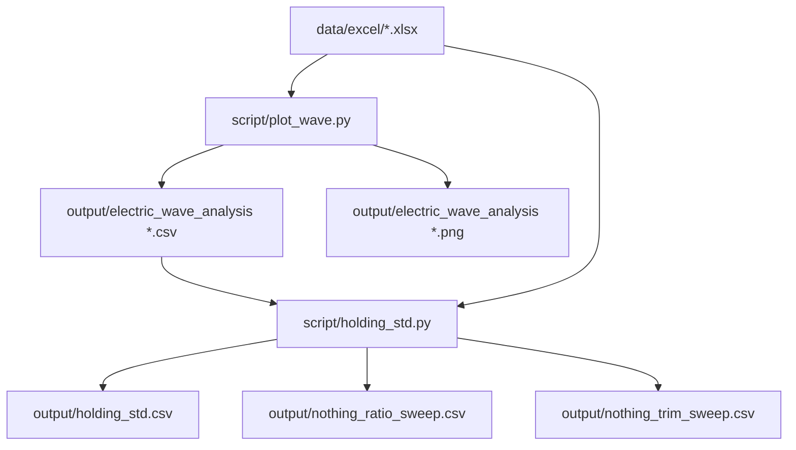
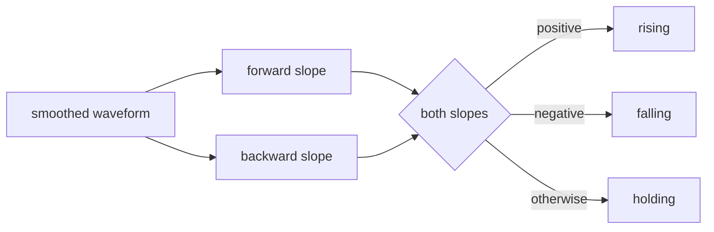

# electric_wave_analysis 프로젝트 요약

## 목적

측정된 파형 데이터에서 구간 상태를 나눈다.

- 상승 구간: `rising`
- 유지 구간: `holding`
- 하강 구간: `falling`

노이즈가 큰 데이터라서 단순한 기울기 비교 대신, smoothing 후 앞뒤 기울기를 같이 본다.

## 현재 폴더 구조

```text
electric_wave_analysis/
├─ data/
│  ├─ excel/                  분석 입력 xlsx
│  └─ electric_wave_analysis_data.xlsx  원본 데이터
├─ script/                    분석 코드
├─ output/                    분석 결과
├─ README.md                  폴더 설명
├─ 실행.md                    실행 순서
└─ electric_wave_analysis_log.md       분석 과정 기록
```



## 주요 파일

| 경로 | 내용 |
|---|---|
| `data/excel/` | 분석에 쓰는 측정 파일 |
| `script/plot_wave.py` | 파형을 `rising / holding / falling`으로 분류 |
| `script/holding_std.py` | holding 구간 표준편차 계산 |
| `script/hold_std.py` | 고정 margin 방식의 보조 표준편차 계산 |
| `output/` | CSV, PNG, 통계 결과 |
| `electric_wave_analysis_log.md` | 알고리즘을 정한 과정 기록 |
| `실행.md` | 실행 순서 정리 |

## 분석 흐름

1. `data/excel/`의 xlsx 파일을 읽는다.
2. 전압 데이터를 smoothing 한다.
3. 각 index에서 앞쪽 기울기와 뒤쪽 기울기를 계산한다.
4. 두 기울기가 모두 양수면 `rising`.
5. 두 기울기가 모두 음수면 `falling`.
6. 나머지는 `holding`.
7. 결과를 CSV와 PNG로 저장한다.
8. holding 구간만 따로 모아 표준편차를 계산한다.

## 상태 분류 기준



## 주요 파라미터

| 이름 | 값 | 의미 |
|---|---:|---|
| `SMOOTH_WINDOW` | 200 | moving average 구간 |
| `SLOPE_SPAN` | 130 | 앞뒤 기울기 계산 거리 |
| `SLOPE_RATIO` | 0.12 | holding 판정 threshold 비율 |

## 결과 파일

`output/`에 생성된다.

| 파일 | 의미 |
|---|---|
| `electric_wave_analysis [파일명].csv` | index별 상태 분류 |
| `electric_wave_analysis [파일명].png` | 상태별 색으로 표시한 파형 |
| `holding_std.csv` | holding 구간 통계 |
| `nothing_ratio_sweep.csv` | ratio trim 비교 |
| `nothing_trim_sweep.csv` | fixed trim 비교 |

## 실행 순서

자세한 내용은 `실행.md` 참고.

```powershell
python script\plot_wave.py
python script\holding_std.py
```

보조 계산이 필요하면:

```powershell
python script\hold_std.py
```

## 주의할 점

- `holding_std.py`와 `hold_std.py`는 먼저 `plot_wave.py` 결과가 있어야 한다.
- 결과 파일 이름이 같으면 `output/`의 기존 파일을 덮어쓴다.
- 분석 기준을 바꾸기 전에는 `electric_wave_analysis_log.md`를 먼저 확인한다.
- 현재 코드는 내부 경로 기준이라 실행 위치와 상관없이 `data/excel/`, `output/`을 사용한다.


